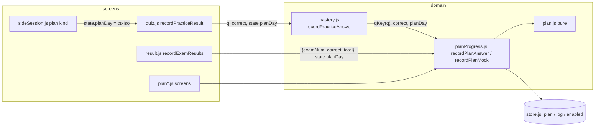
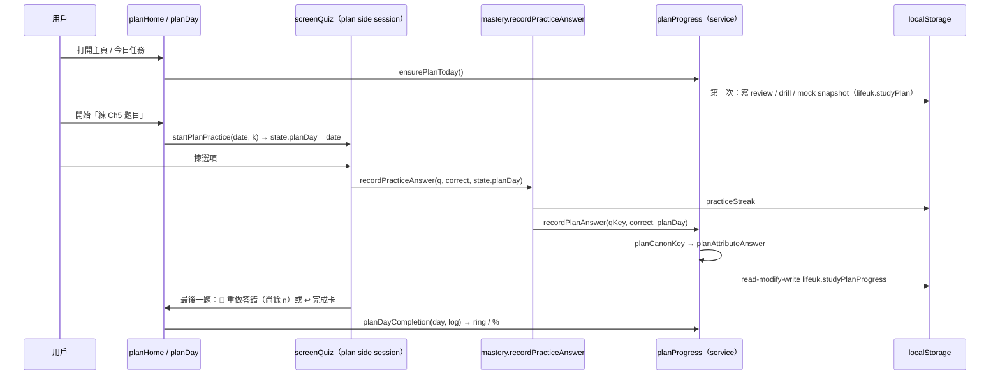

# Architect：溫習計劃（Study Plan）技術可行性 + 模組設計

**日期**：2026-10-08
**作者**：Architect Agent（`/plan`）
**Base**：`main` `ff3e4da`（`APP_VERSION = '1.0.0'`）
**輸入**：`2026-10-08_handoff_study-plan.md`（規格）、`2026-10-08_grill_study-plan.md`（G1–G21，覆蓋 handoff §4 同 +0.01 規則）、`mockups/study-plan-flow.html`、`HANDOFF.md`、現有 code
**狀態**：分析稿，待 PM 整合成 T-xxx implementation plan，再交用戶確認

> 所有數字（題數、fact 數、獨立英文題數）喺 2026-10-08 用 node 直接讀 `data/exams.js` / `data/study.js` 核對過；寫入 code 嘅 headline 數字要喺 `plan-test` assert（SK-020），唔好只寫喺註解。

---

## 0. 已核對嘅事實（Fact-Check）

| 項目 | 結果 | 來源 |
|---|---|---|
| 題目 / fact | 408 題、236 條 fact；每題都喺某條 fact 嘅 `src`（覆蓋 408 / 408） | node 讀 data |
| 同一條英文題目（`q` trim + 細階）| 408 題得 **389 條獨立英文題**；同一英文題**從來唔會跨兩條 fact**（G4 可以安全用「英文題 → canonical key」去重） | node |
| fact `ch` 同題目 `ch` | 0 個唔一致 → 一段知識點嘅題目一定同章 | node |
| 每章（fact / src / 獨立英文題） | Ch1 2 / 9 / 9；Ch2 4 / 11 / 11；Ch3 91 / 167 / 161；Ch4 68 / 113 / 106；Ch5 71 / 108 / 102 | node |
| 一條 fact 最多題 | 8 題（fact #21） | node |
| `recordPracticeAnswer()` call site | 只有 `js/screens/quiz.js` `recordPracticeResult()` 一處 | grep |
| `markExamCompleted()` call site | 只有 `js/screens/result.js` `recordExamResults()`（`finishExam()` 入面；時間到自動交卷都經佢；Leave 唔經） | grep |
| Layer guard | `structure-test` 只守 **components 唔可以用 screens 嘅名**；domain → screen 冇 guard（`questions.js` `isRandomExam()` 已經讀 `state.mode`，係現有漏口）| `tests/structure-test.js` L207–270 |
| Function 長度 | 每個 function ≤ 30 行（`MAX_FUNCTION_LINES`，掃晒 `js/**`）| `structure-test` |
| i18n | `js/`、`index.html`、`sw.js` 唔准有 CJK；動態 key 只准 `DYNAMIC_PREFIXES` 白名單 | `i18n-test` |
| 顏色 | `tokens.css` 以外嘅 css 唔准 hex / `rgb(`；每個 `var(--x)` 要有定義 | `structure-test` |
| Playwright | `playwright-core` 1.56.1（有 `page.clock` API、`newContext({ timezoneId })`）| `/opt/node-tools` |
| Shell 混合頁面 | 舊 cached `index.html` + 新 js：新 file 喺常用路徑被 call 就要入 `LATE_BOOT_SCRIPTS`，CSS 搬 / 新 file 入 `LATE_BOOT_STYLES` | `js/main.js`、HANDOFF「加新 file 嘅規則」 |

---

## A. 可行性

| 範疇 | 評估 | 結論 |
|---|---|---|
| 技術棧 | 純 vanilla JS classic script + 全局變量，冇 build tool。排程、完成度全部係純函數，冇需要新 library；日期用 `Date` + ISO 字串（`YYYY-MM-DD`），月曆用自己砌嘅 grid | ✅ 可行，零 dependency |
| 依賴（現有 code） | 要細改 6 個現有 file：`mastery.js`（`recordPracticeAnswer` 加參數）、`quiz.js`（傳 plan day、`startExam` 收 mode）、`sideSession.js`（新 return kind）、`result.js`（交卷 hook + plan 掣行）、`similarPanel.js` / `factCard.js`（CTA 參數化）、`i18n.js`（`SCREEN_RERENDER`）、`main.js`（late boot）、`actions.js`（新 action）| ✅ 全部係加參數 / 加分支，唔改現有行為；每處有現成測試守住 |
| 性能 | 最長計劃 ≈ 183 日。`buildPlan` O(日數 × 236 fact)；完成度每次 render 計 ≤ 183 日 × ≤ 10 task × ≤ 24 題 lookups ≈ 4 萬次 object lookup，< 5 ms。月曆一版 ≤ 42 格。Progress log 喺記憶體 cache，每次答題 stringify ≤ ~200 KB | ✅ 冇性能風險；唔使 memo，但 `dayCompletion` 喺同一次 render 入面可以用 `Map` cache |
| 儲存 | 見 B.5：最壞情況 < 300 KB（origin 共用 5 MB）| ✅ |
| 安全 | 冇網絡、冇用戶輸入落 HTML（日期 input 經 parse；其他全部 `t()` / `escapeHtml`）。LS 讀返嚟嘅 plan 要 shape validate（同 CUI-0003 studyPrefs 一樣：壞資料當冇計劃，唔 throw）| ✅；要有 corrupt-data 測試 |
| 離線 / PWA | 新 file 跟三步規則（index → SHELL → 最後 PR 升 1.1.0）；中間 PR 唔升版本（G19），已安裝 PWA 繼續用舊 cache 成套舊 file，唔會混合 | ✅；見風險 R1 |
| i18n | 新增約 120–150 個 key（`plan.*`、`modal.plan*`、`data.weekdays.*`、`data.planLevels.*`）；zh-HK **書面語**（G21），en 另譯（G20 對照表）| ✅；工作量大，見風險 R10 |

**總體結論：可行（Go）。** 主要難度唔喺技術，而喺三樣嘢：(1) 日程要持久化兼可以「凍結過去 + 由今日重排」（G7）；(2) 完成度要由「任何地方答啱」自動推算，又要按入口日子歸屬（G2 / G5 / G8）；(3) 重用 `screenQuiz` 而唔複製 markup。下面嘅設計用「**答題 log 同任務分開存，完成度 = 任務 ∩ 當日 log**」一招同時解決 (1)(2)，用「plan side session」解決 (3)。

---

## B. 資料模型

### B.1 核心設計決定

1. **答題 log 同日程分開**：日程（`lifeuk.studyPlan`）好少寫（建立、改目標、每日第一次打開做 snapshot）；log（`lifeuk.studyPlanProgress`）每答一題寫一次。分開 key 令每次寫細啲，壞咗一邊唔會連累另一邊。
2. **Log 按日期記答題，唔按任務記**：`log.days[iso].ok[qid]`。任務完成度 = 任務嘅題目 ∩ 當日 `ok`。好處：
   - G2：喺 Practice / 錯題 / Flagged / Similar 答啱，只要寫入正確日子，任何包含呢題嘅任務自動計
   - G7：重排之後新任務即刻「認返」今日已經答啱嘅題，唔使搬 progress
   - G5：強化階段係另一日，Day 5 嘅 `ok` 唔會令 Day 16 完成（按日分開）
3. **題目 id 用 canonical key（G4）**：`PLAN_CANON_QKEY["9.14"] = "3.5"`（同一英文題取 exam 次序第一個 key）。Log 同任務一律存 canonical；任何 duplicate 答啱都計同一題。
4. **日子 id 用本機 ISO 日期**（G6）：`"2026-10-14"`。Day n = `isoDiffDays(plan.start, iso) + 1`，計法用 `Date.UTC(y, m-1, d) / MS_PER_DAY`，唔受 DST（2026-10-25 英國轉冬令時間）同時區影響。
5. **Lazy materialisation**：要睇當時狀態先知內容嘅任務（清錯題 G9、強化「再練未掌握」、重溫錯題知識點、模擬考用邊份 Exam）建立時只存「配額」，**嗰日第一次打開**（今日任務頁或主頁計劃卡）先揀實題目並寫入日程（之後凍結）。

### B.2 `lifeuk.studyPlanEnabled`

- 值：`false` / `true`；**冇值 = 開**（預設開）。只有用戶撳 ⓘ switch 先寫。
- 唔入 `LEGACY_LS_MIGRATION` / `MERGE_LS`（新 key，冇舊名）。

### B.3 `lifeuk.studyPlan`（日程，持久化，G7）

```js
{
  v: 1,                                  // schema 版本；唔認識嘅 v → 當冇計劃顯示，但唔刪（將來 migrate）
  start: '2026-10-08',                   // Day 1（建立日，G6；改目標都唔變）
  createdAt: '2026-10-08',
  goal: {                                // 最新目標（改目標會覆寫）
    examDate: '2026-10-29',              // 考試日（唔排任務，G16）
    dailyMins: 60,                       // 30–120，step 15
    restDays: [0],                       // 0 = 星期日
    level: 'none',                       // 'none' | 'some' | 'exam'（PLAN_LEVELS key）
  },
  goalHistory: [{ at: '2026-10-12', goal: { … } }],   // 改目標前嘅舊 goal（debug / 總結用，可選）
  days: [                                // index = Day n - 1；長度 = examDate - start（考試日唔喺 array）
    { date: '2026-10-08', phase: 'learn', tasks: [ /* Task */ ] },
    { date: '2026-10-09', phase: 'rest', tasks: [] },
    …
  ],
}
```

**Task（`type` 決定欄位）**

| type | 建立時存 | 第一次打開時補（materialise） | 完成條件 |
|---|---|---|---|
| `read`（讀知識點） | `ch`, `facts: [id…]`, `pair: k`（同日 practice task 嘅 index） | — | 每條 fact：今日任務入面排咗嘅佢全部 canonical 題目喺嗰日 `ok`（G3 / G4） |
| `practice`（練題目） | `ch`, `qids: [canon…]` | — | 每題嗰日 `ok` |
| `drill`（強化：再練未掌握） | `ch`, `quota: n` | `qids`（未 🏆 → 計劃內答錯過 → 其他，同章，`quota` 題）| 每題嗰日 `ok`（G5 再答啱一次） |
| `wrongFacts`（重溫答錯題目嘅知識點） | `quota: n` | `facts` + `anchor: {factId: canonQid}`（Similar panel 嘅 current 題）| 同 `read` |
| `review`（清錯題，G9） | — | `qids`：`keysOf(wrongList)` 頭 `PRACTICE_ROUND_MAX` 題（canonical、去重）；空 = `[]` | 每題嗰日 `ok`；`qids.length === 0` = 自動完成「✓ 冇錯題」 |
| `mock`（模擬考，G10） | `slot: k` | `exam: n`（優先未 ✓ completed 嘅 Exam 1–17，輪住）| 嗰日有 **≥ k+1 次合格** attempt（≥ 18/24，`PASS_RATIO`）|

其他欄位：`moved: '2026-10-12'`（G7 重排時，舊日子未完成嘅 task 標記「已移入新日程」：唔再入補做，但完成度照凍結顯示）、`light: true`（最後一個溫習日嘅輕鬆重溫）。

### B.4 `lifeuk.studyPlanProgress`（答題 log）

```js
{
  v: 1,
  days: {
    '2026-10-14': {
      ok:  { '3.5': 1, '7.2': 1 },       // 嗰日答啱過（一次啱就算，之後答錯唔扣）
      bad: { '3.5': 1 },                 // 嗰日答錯過（「✗ k」、「你答錯過」G17、同日重出）
      mock: [ { exam: 4, correct: 19, total: 24 }, { exam: 'all', correct: 16, total: 24 } ],
    },
  },
}
```

- 「答錯唔計，要答啱先算」：`ok` 決定完成，`bad` 只用嚟顯示同排「重做」round。
- `bad` 但未 `ok` = 「k 題答錯，要答啱先計」。
- 唔記用戶揀咩（G17）。

### B.5 容量估算（要寫成 `plan-test` assertion，SK-020）

| 部份 | 最壞情況 | 估算 |
|---|---|---|
| 日程 `days` | 183 日 × ~70 byte 外殼 + learn task 列晒 389 canonical key（~8 byte）+ 236 fact id（~4 byte）+ drill / review / mock materialise（每日 ≤ 24 key）| ≈ 5 KB + 183 × 24 × 8 ≈ **40 KB** |
| Log | 183 日 × 每日 ≤ 120 題 × `ok` + `bad`（~10 byte / entry）| ≈ **220 KB** |
| 合共 | | **< 300 KB**（origin 5 MB 嘅 6%；同 origin 有其他 app，見 R16） |

`plan-test`：砌 183 日、每日 120 題 log 嘅 fixture，assert `JSON.stringify` 兩個 key 合共 < `PLAN_STORAGE_BUDGET_BYTES`（300 000）。

### B.6 同現有 LS 機制點配合

| 機制 | 處理 |
|---|---|
| `LS_PREFIX` | 三個 key 都經 `config.js` 常數：`STUDY_PLAN_ENABLED_LS`、`STUDY_PLAN_LS`、`STUDY_PLAN_PROGRESS_LS` |
| `LEGACY_LS_MIGRATION` / `MERGE_LS` | **唔加**（新 key，冇舊名；HANDOFF：「加新 key 唔使改，只有改名先要加」）|
| `OBSOLETE_LS` | 唔郁 |
| `getLS` / `setLS` | 照用（經 `lsKey()`，遷移 fallback 自動生效）。要新增 `removeLS(key)`（`utils.js`，同樣經 `lsKey()`），俾「重設計劃」刪 key |
| **開機唔准寫 storage** | `upgrade-test` ③ assert「新 key 只多 marker」、`migrate-test` 斷言 app 寫入只落 `lifeuk.*`：**冇計劃時任何 render 都唔可以寫 plan key**；有計劃時 materialise 先寫（呢個情況舊測試唔會 seed 計劃，所以唔衝突）|
| Corrupt 資料 | `parseStoredPlan(raw)` / `parsePlanLog(raw)` 做 shape check；唔啱 → 當冇計劃 / 空 log，**唔覆寫**（用戶可能用新版再開）；`studyprefs-test` 式測試 |
| 多 tab | 每次寫 log 之前 `getLS` 重讀再 merge 落去（read-modify-write），唔好淨係寫記憶體 copy，避免兩個 tab 互相蓋（見 R17）|

---

## C. 純函數 domain 設計

### C.1 檔案分工

| 檔案 | 內容 | 讀 global |
|---|---|---|
| `js/domain/plan.js` | 日期工具、canonical 題目、排程（build / feasibility / replan）、目標 validation、parse | `STUDY`、`EXAMS`（經 `questionByKey`）、`config.js` 常數。**唔讀 `state`、`streaks`、`wrongList`、DOM、`Date.now()`**（今日由參數傳入）|
| `js/domain/planProgress.js` | 完成度、歸屬、補做、round queue、KPI、materialise；最底一節「service」：讀寫 store、`recordPlanAnswer` / `recordPlanMock` / `ensurePlanToday` | 純函數部份同上；service 部份讀 store（同 `mastery.js` `saveStreaks()` 一樣嘅層次）|

所有頂層名加 `plan` / `PLAN_` 前綴（classic script 共用 global scope：mockup 嘅 `chapterOf`、`state`、`runAction`、`isoDate` 全部同現有名撞，S-036 教訓）。每個 function ≤ 30 行；tuning constant 放 `plan.js` 頂（唔放 `config.js`：config 要 worker-safe 而且唔關 SW 事；只有 `STUDY_PLAN_READY` 同 LS key 入 config）。

### C.2 `js/domain/plan.js` signature

```js
// ── tuning（mockup LEVELS 等，G12：估算值做 constant）──
const PLAN_STUDY_ORDER = [1, 2, 5, 4, 3];
const PLAN_LEVELS = { none: { minPerFact: 1.5, minPerQ: 0.75, mockShare: 0.2 }, some: {…}, exam: {…} };
const PLAN_SECOND_PASS_RATIO = 0.4, PLAN_MIN_MOCK_DAYS = 1, PLAN_MOCK_BLOCK_MINS = EXAM_MINUTES + 15,
      PLAN_MIN_MOCKS = 5, PLAN_MAX_MOCKS_PER_DAY = 2, PLAN_REVIEW_SLOT_MINS = 15,
      PLAN_FEAS_OK = 1.15, PLAN_FEAS_TIGHT = 0.95, PLAN_MINS = { min: 30, max: 120, step: 15 },
      PLAN_EXAM_DAY_PRESETS = [14, 21, 28, 42], PLAN_MIN_DAYS = 7, PLAN_MAX_MONTHS = 6,
      PLAN_MIN_STUDY_DAYS = 3, PLAN_SAFE_SCORE = 21;

// ── 日期（純；ISO 'YYYY-MM-DD' 本機日期）──
function planTodayIso(now = new Date())            // 唯一讀時鐘嘅 function，只喺 screen / service call
function isoDayNumber(iso)                          // Date.UTC(...) / MS_PER_DAY，DST-safe
function isoAddDays(iso, n) → iso
function isoDiffDays(fromIso, toIso) → int
function isoWeekday(iso) → 0..6
function planExamDateRange(todayIso) → { min, max }  // +7 日 … +6 個月

// ── 題目 ──
const PLAN_CANON_QKEY                               // { "exam.idx": canonical key }，load 時由 allQuestions() 計
function planCanonKey(k) → canonical key
function planFactQids(f) → [canonical…]             // f.src 去重
const PLAN_TOTAL_QIDS                               // 389（plan-test assert）

// ── 排程 ──
function planCalendar(startIso, examIso, restDays) → [{ date, rest }]
function planLearnItems(level, factIds = all) → [{ ch, factId, w }]   // w = minPerFact + qids.length × minPerQ（真 src，取代 pairedQuestions）
function planChunkWeighted(items, dayCount) → [[{ ch, factIds }]]     // 同章連續合併；mockup 算法
function planDrillQuotas(level, dayCount) → [[{ ch, quota }]]
function planNeedMinutes(level) → mins
function planSplitStudyDays(studyDays, goal) → { learn, drill, mock, overload }   // G13，見 C.4
function planFeasibility(goal, todayIso) → { studyDays, restCount, availMins, needMins, ratio,
                                            status: 'ok' | 'tight' | 'short', diffMins, overload }
function validatePlanGoal(goal, todayIso) → { ok, errors: ['examDate' | 'dailyMins' | 'restDays' | 'level' | 'studyDays'] }
function buildPlan(goal, todayIso) → plan            // B.3 shape；start = todayIso
function buildPlanDays(fromIso, goal, learnFactIds, examCursor) → days   // build / replan 共用
function replanFrom(plan, goal, todayIso, log) → plan   // G7，見 C.5
function parseStoredPlan(raw) → plan | null
```

### C.3 `js/domain/planProgress.js` signature

```js
// ── 位置 / 狀態 ──
function planDayNumber(plan, iso) → 1-based
function planDayAt(plan, iso) → day | null
function planStatus(plan, todayIso) → 'active' | 'examDay' | 'ended'      // G16
// ── materialise（純：回傳新 day + changed；service 先寫 storage）──
function materializePlanDay(day, ctx) → { day, changed }   // ctx = { wrongKeys, streaks, completedExams, log, examCursor }
// ── 完成度（G3 / G4 / G5）──
function planTaskItems(task) → { kind: 'q' | 'fact' | 'mock', ids }
function planTaskProgress(task, dayLog) → { done, total, ok, bad, pct, complete, pending }   // pending = 未 materialise
function planDayCompletion(day, dayLog) → { pct, done, total, tasks }   // 只計嗰日自己 task（補做唔計，G8）
function planCarryTasks(plan, log, todayIso) → [{ date, dayNumber, taskIndex, task }]   // G8：已過、未完成、非 mock、未 moved
function planNextStep(plan, log, todayIso) → { kind: 'today' | 'carry' | 'done', task, resumeAt }   // 主頁「由 #74 繼續」
// ── 答題歸屬（G2 / G5）──
function planAttributeAnswer(plan, log, qid, todayIso, ctxIso) → iso | null
function planAttributeMock(plan, log, todayIso, ctxIso) → iso | null
function planApplyAnswer(log, iso, qid, correct) → log
function planApplyMock(log, iso, attempt) → log
// ── runner queue（「答錯同日做晒其他題後重出」）──
function planNextRound(task, dayLog, skipped) → [canonical…]   // 未答（skipped 擺後）→ 答錯未啱；≤ PRACTICE_ROUND_MAX
function planRetryLeft(task, dayLog) → n                         // 「🔁 重做答錯嘅題目（尚餘 n 題）」
// ── 總覽 ──
function planKpis(plan, log, todayIso) → { planPct, dayNumber, totalDays, avgPct, daysLeft,
                                           factsDone, factsTotal: 236, qidsDone, qidsTotal: 389, safeMocks, mocksPlanned }
function planPctBand(pct) → 0..4      // 0 / <50 / <75 / <100 / 100 → class h0–h4（顏色見 F.4）
function planMonthGrid(plan, log, year, month, todayIso) → [{ iso, inPlan, past, today, examDay, pct }]
function planMonths(plan) → [{ year, month }]

// ── service（讀寫 store；screen 同 hook call 呢度）──
function recordPlanAnswer(key, correct, ctxIso = null)   // key = "exam.idx"；冇計劃 / 已完結 → no-op
function recordPlanMock(result, ctxIso = null)           // result = { examNum, correct, total }
function ensurePlanToday(now = new Date())               // materialise 今日（同所有已過但睇緊嘅日子）；冇計劃唔寫
```

### C.4 各規則點落實

| 規則 | 落實 |
|---|---|
| **buildPlan** | `planCalendar` → 溫習日 `study`；最後一個溫習日 = 輕鬆重溫（`light`）；其餘 `n = study.length - 1` 交 `planSplitStudyDays`；learn 用 `planChunkWeighted(planLearnItems)`（次序 `PLAN_STUDY_ORDER`，章內跟 `STUDY` 次序 = Study 卡號），每個 chunk group 出 `read` + `practice`（`qids` = 嗰批 fact 嘅 `planFactQids` 合併）+ 每日一個 `review`；drill 日 = `drill` × 章 + `wrongFacts`；mock 日 = `mock` × `min(PLAN_MAX_MOCKS_PER_DAY, floor(mins / PLAN_MOCK_BLOCK_MINS))`（最少 1）+ `review`。建立日係休息日照當休息（G6）|
| **可行性** | `availMins = studyDays × dailyMins`；`needMins = planNeedMinutes(level)`（learn + drill + `PLAN_MIN_MOCKS` × block）；`ratio` ≥ 1.15 ✓、≥ 0.95 △、否則 ✕；`studyDays < PLAN_MIN_STUDY_DAYS` → `errors: ['studyDays']`，CTA disabled（休息日揀太多；見 Q-A6）|
| **G13 時間唔夠** | `learnFit = ceil(learnMins / (dailyMins - PLAN_REVIEW_SLOT_MINS))`；`learn = clamp(learnFit, 1, n - PLAN_MIN_MOCK_DAYS)`；`rest = n - learn`；`mock = max(PLAN_MIN_MOCK_DAYS, round(rest × mockShare / (mockShare + drillShare)))`，`drill = rest - mock`。learnFit > learn 時 `overload = true`：每日 learn chunk 自然變大（chunkWeighted 平均分），**全部 236 fact / 389 題一定排晒**（`plan-test` 守）|
| **dayTasks** | 直接讀 `plan.days[i].tasks`（已持久化）+ `materializePlanDay`；補做另外由 `planCarryTasks` 出 |
| **完成度（G3 / G4 / G5）** | `practice` / `drill` / `review`：`done = qids ∩ dayLog.ok`；`read` / `wrongFacts`：fact 嘅 qids（只計**嗰日任務入面**排咗嘅，即係 `pair` practice 嘅 qids ∩ `planFactQids(f)`）全部 `ok` 先算；`mock`：合格 attempt 數 ≥ slot + 1 → done = total（`REAL_TEST_SIZE` 個單位），否則 0（Q-A3）；`total = 0`（冇錯題）→ 當 1 個單位完成。日 % = Σdone / Σtotal |
| **補做（G8）** | `planCarryTasks`：`date < today`、`status === 'active'`、task 未 complete、`type !== 'mock'`、冇 `moved`。今日頁列晒（橙框 + Day n tag），runner context = 原本日子，答啱寫入原本日子 log；唔計今日 %。關開關期間（G14）日子照行，開返自動喺呢度出現（唔使特別 code）|
| **歸屬（G2 / G5）** | `planAttributeAnswer`：①有 `ctxIso`（由計劃頁入去）→ 嗰日（已過 = 補做、未到 = 提早做）；②否則今日任務（含今日 review / drill，materialised）有呢題 → 今日；③否則最早一個補做 task 有呢題而未 `ok` → 嗰日；④否則 `null`（唔記）。`planStatus !== 'active'`（考試日或之後）→ 只接受 ctxIso 為 null 嘅 ①…實際上全部 `null`（G16 補做停止）|
| **模擬考（G10 / G11）** | `recordPlanMock`：attempt 一律寫入（`planAttributeMock` 揀日：ctxIso → 嗰日；否則今日有 mock task → 今日；mock 唔入補做 → 唔會落已過日子）；只有 Exam 1–17 同 Random Exam 計（`isNumberedExam` / `isRandomExam`）。唔合格 → task 卡顯示分數 +「再考 Random Exam」（`startExam(ALL_EXAM, EXAM_MODE)`）|
| **考試日後（G16）** | `planStatus`：`today === examDate` → `examDay`（今日頁「🎯 今日考試，加油」，冇任務）；`today > examDate` → `ended`（主頁卡「計劃已完結」+ 總結 `planKpis` +「建立新計劃」/「改目標」；歸屬全部停；進度表 / 月曆照睇）|
| **G6 換日** | domain 冇時鐘；screen 層 `planWatchDay()`：`visibilitychange`（返前台）+ `setTimeout` 到下一個本機午夜（+1 s），觸發時如果 `planTodayIso()` 變咗 → `ensurePlanToday()` + `rerenderCurrentScreen()`。時區改咗：下次 `planTodayIso()` 自然跟新本機日期 |

### C.5 Reschedule（G7）`replanFrom(plan, goal, todayIso, log)`

1. `frozen = plan.days.filter(d => d.date < todayIso)` —— 原封不動（任務、snapshot），完成度由 log 照計，所以「凍結」係自動。
2. 搵未完成嘅 learn 內容：`frozen` 入面 `read` task 未 complete 嘅 fact，加埋 `days ≥ today` 所有 learn fact（保持原本次序，去重）。今日已答啱嘅題留喺 log，新今日任務會即刻認返。
3. 舊補做合入重排：步驟 2 用咗嘅 frozen task、同埋 frozen 入面未完成嘅 `drill` / `wrongFacts` / `review` 標 `moved: todayIso` → 唔再入補做，完成度照顯示（G7「舊補做合入重排」）。
4. `buildPlanDays(todayIso, goal, remainingFactIds, examCursor)`：由今日排到新 `examDate - 1`，learn 先、再 drill、再 mock（G7 次序），休息日 / 每日時間用新 goal。
5. `plan.days = frozen.concat(newDays)`；`plan.start` 唔變（Day 編號由原本 Day 1 計）；舊 goal 推入 `goalHistory`。
6. 新 examDate 早過今日 + 7 日 → `validatePlanGoal` 擋（同建立一樣嘅下限，以**今日**計）。

`plan-test` 要覆蓋：過去 3 日完成度 replan 前後一字不差；全部 236 fact 喺 replan 後仍然各出現一次（未完成）或者已完成；Day 編號連續；moved 嘅 task 唔入 `planCarryTasks`。

---

## D. Hook 點（唔破壞 layer 規則）



| Hook | 改動 | 理由 |
|---|---|---|
| **Practice 答題（G2）** | `mastery.js`：`recordPracticeAnswer(q, correct, planDay = null)`，`saveStreaks()` 之後 call `recordPlanAnswer(qKey(q), correct, planDay)`。`quiz.js` `recordPracticeResult(q, correct)` 改傳 `state.planDay \|\| null` | 字面上符合 G2「`recordPracticeAnswer()` 加 hook」；domain **唔讀 `state`**（context 由 screen 用參數傳入），守住方向 screen → domain → store。所有 Practice 類（Chapter / Difficulty / Exam / 錯題 / Flagged / Similar / Fact / 計劃 runner）都經呢一點 |
| **Exam 交卷（G10）** | `result.js` `recordExamResults()` 尾加 `recordPlanMock({ examNum: state.examNum, correct, total }, state.planDay \|\| null)`；service 內判斷 `isNumberedExam` / Random（`isRandomExam` 讀 `state.mode`，所以 screen 傳 `isRealTest: isNumberedExam(…) \|\| isRandomExam(…)` 落去，domain 唔再讀 state）| `finishExam()` 時間到都經呢度；G15「離開」唔經 `finishExam` → 唔記，正係要求 |
| **Exam 逐題答案** | **唔**計入 practice 題目完成度（G2 列表冇 Exam；Exam 冇 reveal）| 見 Q-A7 |
| **`state.planDay`** | 只由 plan side session / plan mock 設定；`sideSessionState()` 預設 `planDay: null`；`startExam()` 清做 `null`，plan mock 喺 `startExam` 之後再設 | 普通 Practice 一定係 `null` → 用 G5 規則 ②③ 歸屬 |
| **混合 shell（R1）** | `mastery.js` / `result.js` 係舊 file 會 call 新 file 嘅 `recordPlanAnswer` → `planProgress.js`、`plan.js` 加入 `LATE_BOOT_SCRIPTS`（`ready: () => typeof recordPlanAnswer === 'function'`），次序 plan → planProgress | HANDOFF「加新 file 嘅規則」；否則舊 `index.html` + 新 js 每答一題 `ReferenceError`（`upgrade-test` ① 要加 assert）|

Layer：`structure-test` 只守 components ↛ screens；本設計另外遵守「domain 唔讀 screen state」，建議喺 `structure-test` 加一條：`js/domain/plan*.js` 唔用 `js/screens/*.js` 頂層名（同現有 `layerHits` 一樣機制，只係多掃兩個 file；唔掃 `questions.js` 以免撞現有 `isRandomExam` 漏口）。

---

## E. Runner：重用現有 screen

### E.1 練題目 / 強化 / 清錯題 = plan side session

- `sideSession.js` 加 `SESSION_RETURN_KIND.plan`：`{ kind: 'plan', date, taskIndex, carryFrom? }`。
- `startPlanPractice(date, taskIndex)`：`qids = planNextRound(task, dayLog, skipped)` → `startSideSession(PLAN_PREFIX + dayNumber, qids.map(questionByKey).map(toQuestionItem), ret)`，再設 `state.planDay = date`。`PLAN_PREFIX = 'p'`（`isPlanExam()` 跟 `isFactExam` 寫法：`p` + 數字，唔會撞 `ALL_EXAM` 等）；`examLabel()` 加一行 → `plan.dayN`。
- **完全係 `screenQuiz`**：`nav-dots` / `dots-meta`、`q-card`、Translate、`opt` 即時對錯、`answer-box`、`nav-row`、flag；每輪 ≤ 24 題（`PRACTICE_ROUND_MAX`）；未答可以 Next（現有行為），未答嘅下一輪再出。
- **答錯同日重出**：`nextAction()` 最後一題加一個分支（排喺 `isSideSession()` 之前）：`isPlanSession()` 而 `planRetryLeft() > 0` 或者仲有未答 → label `plan.retryWrong`（「🔁 重做答錯的題目（尚餘 {n} 題）」）、run = `startPlanPractice` 下一輪（同一個 return）；否則 ↩ → `returnFromSideSession()` → plan 任務完成卡（E.4）。`renderRoundNote()` 加 plan 分支顯示「第 n 輪」/「重做答錯的題目」。
- **清錯題 runner**：`recordPracticeResult` 嘅清錯題條件由 `state.examNum === WRONG_EXAM` 擴做 `\|\| isPlanReviewSession()`（G9 任務就係清錯題；否則用戶喺計劃清完，錯題簿仍然有）。
- Similar panel：side session 一律唔顯示（`renderSimilar` 現有 `!isSideSession()`）；`sessionReturn` 只有一格，plan session 入面再開 Similar session 會冇得返計劃 → 維持收埋（Q-A4）。
- 雙擊 guard：view = `.screen.active` + `state.questions`，plan 頁 ↔ quiz 都會換 view，自動受保護。

### E.2 讀知識點 = 新 `#screenPlanRun`（只有 header + 一張卡 + nav-row）

- 卡 = `factCardHtml(f, { variant: 'full', marks: factMarks(f), opts })`（Study 嘅 marks；`studyToggleMark` 之後要 `rerenderCurrentScreen()` 而唔係淨 `renderStudy()`）。
- 來源列「▶ Practise these N」會開 Study fact session 返 Study —— 喺計劃入面要改去練嗰日 `pair` task：`factCardHtml` 加 `opts.practise = { action, arg }`（component 參數，唔 call screen；預設照舊 `startFactPractice`）。
- 頂部 n / m、`nav-row`（上一條 / 下一條）。**讀本身唔記完成**（G3：要答啱題）；最後一條「下一條」變「練習這 {n} 題 →」→ 開 `pair` practice session。

### E.3 重溫答錯題目嘅知識點 = Similar `.sqm` panel

- `similarPanelHtml(q, keys)` 加第三個參數 `cta = { action: 'startSimilarPractice' }`（預設不變）；plan 用 `{ action: 'planPractiseFact', arg: factId }`，`q` = materialise 時嘅 `anchor`（答錯嗰題 = current node），`keys` = 同 fact 其他題。Panel markup 100% 重用。

### E.4 任務完成 Result 卡 / 重溫模式

- 完成卡：`#screenPlanRun` 入面用 `.result-card` / `.result-emoji` / `.result-score` / `.result-label` / `.result-sub` class（`results.css`）砌，**唔重用 `#screenResult`**（嗰個係 exam 結果頁，有 By Difficulty / review list，唔適合）；「重溫呢項內容」+「開始下一項 →」用 `.nav-row` / `.nav-btn`；全部完成 🎉。
- **重溫模式（G17）**：已完成 task 入去 → plan side session 但 `state.planReview = true`：`answers[i] = q.a`、`revealed[i] = !dayLog.bad[qid]`（點樣都 reveal，所以 `selectOption` 直接 return、唔會記錄）；`renderAnswerBox` 加一個分支：`planReview` 時 label = `plan.reviewCorrect`（✓ 正確答案）/ `plan.reviewWasWrong`（✗ 你答錯過 · 正確答案）。圓點自動綠 / 紅。頂部 note「✅ 此項已完成 · 現在是重溫，不會改變完成度」（`#roundRow` 重用）。讀 task 重溫 = `#screenPlanRun` 照睇卡。

### E.5 模擬考

- `startPlanMock(date, taskIndex)`：`startExam(task.exam, EXAM_MODE)` → `state.planDay = date`。`startExam(examNum, mode = pendingMode)` 加參數，唔改 `pendingMode`（避免首頁 mode 被計劃改咗；`startDifficulty` 現有寫法會改，plan 唔跟）。
- 計時 45 分鐘、Leave modal、時間到自動交卷全部現有。
- 交卷 → 現有 `#screenResult` + 新增 `#resultPlanRow`（hidden，`state.planDay` 有值先出）：合格「✓ 模擬考試任務完成」/ 唔合格「未合格（需要 18 / 24），可以再考 Random Exam」+「返回今日任務」/「再考 Random Exam」。`retryExam()` 喺 plan context 用 `ALL_EXAM`（G11）。

---

## F. Screen / CSS / 載入 / 收埋入口 / i18n

### F.1 新檔案

| 檔案 | 內容 |
|---|---|
| `js/domain/plan.js` | C.2 |
| `js/domain/planProgress.js` | C.3（含 service）|
| `js/components/switch.js` | `switchHtml({ id, on, action, labelKey })`（`role="switch"`、`aria-checked`、44px hit area）|
| `js/screens/planHome.js` | 主頁計劃卡 / 建立卡、ⓘ「功能」switch、開關確認（G15）、`planEntryReady()`、`planWatchDay()` |
| `js/screens/planGoal.js` | 訂立 / 改目標：chip、date、slider + 刻度、休息日、程度 `.mode-card`、可行性 |
| `js/screens/planSchedule.js` | 進度表：phase bar、策略卡、次序卡、每日 list（sticky WEEK、scroll 到今日、已過淡化、status pill）、改目標、↺ 重設 |
| `js/screens/planDay.js` | 今日任務 / Day n：header ‹ ›、ring、task list（未開始 / 進行中 / 完成 / 補做）、月曆、整體進度、考試日 / 完結 |
| `js/screens/planRun.js` | `#screenPlanRun`（讀卡、完成卡）、plan side session / mock 入口、重溫 |
| `css/components/switch.css` | 開關 |
| `css/screens/plan.css` | 計劃所有 screen（mockup `sp-*` 改名 `plan-*`，全部 `var(--space-*)` / token）|

**現有 file 改動**：`config.js`（`STUDY_PLAN_READY`、3 個 LS key、`PLAN_PREFIX`）、`utils.js`（`removeLS`）、`store.js`（`readStudyPlan` / `writeStudyPlan` / `readPlanLog` / `writePlanLog` / `clearStudyPlan` / `isStudyPlanEnabled` / `setStudyPlanEnabled`）、`questions.js`（`isPlanExam`、`examLabel`）、`mastery.js`、`quiz.js`、`sideSession.js`、`result.js`、`similarPanel.js`、`factCard.js`、`home.js`（`leaveToHome` / `startApp` 後 render 計劃卡）、`i18n.js`（`SCREEN_RERENDER` 加 4 個 plan screen）、`actions.js`（約 20 個 action）、`main.js`（late boot）、`index.html`、`sw.js`、兩個 locale。

### F.2 `index.html` 載入次序 / markup

```
… js/domain/questions.js → mastery.js → similar.js → plan.js → planProgress.js
→ components: icons → dots → tags → modal → popover → factCard → switch
→ screens: home → quiz → examTools → sideSession → similarPanel → result → flagged → study
           → planHome → planGoal → planSchedule → planDay → planRun
→ core/actions → pwa → main
CSS：components/… fact.css → switch.css；screens/… study.css → plan.css
```

`plan.js` 要喺 `similar.js` 之後（頂層 `PLAN_CANON_QKEY` 用 `allQuestions()`；`planFactQids` 喺 function 入面先用 `FACT_BY_QKEY`）。Markup：`#planCard`（主頁「選擇模式」上面）、`#infoPlanRow`（`#infoPop` 入面「功能」部份）、`#screenPlanGoal`、`#screenPlanSchedule`、`#screenPlanDay`、`#screenPlanRun`、`#resultPlanRow`；全部靜態字用 `data-i18n`，JS 填嘅留空；顯示 / 收埋用 `hidden`。

**`sw.js` SHELL** 加 10 個 path（8 個 js / css 新 file + 確認 `css/components/switch.css`、`css/screens/plan.css`）；`sw-test` 會自動查 index.html 每個 tag。

**`main.js`**：`LATE_BOOT_SCRIPTS` 加 `js/domain/plan.js`、`js/domain/planProgress.js`（hook 路徑），同 `js/screens/planHome.js`（`startApp` / `leaveToHome` 會 call `renderPlanCard()`）；`js/components/switch.js` 跟 planHome。`LATE_BOOT_STYLES` 加 `css/screens/plan.css`、`css/components/switch.css`（舊 shell 冇 `<link>`）。或者：`home.js` call 計劃卡時用 `typeof renderPlanCard === 'function'` guard —— **唔建議**，HANDOFF 已經定咗 late-boot 做法，一致性較好。

### F.3 `STUDY_PLAN_READY` 收埋入口（G19）

- `config.js`：`const STUDY_PLAN_READY = false;`（worker-safe const）。
- `planHome.js`：`function planEntryReady() { return STUDY_PLAN_READY; }`、`function planVisible() { return planEntryReady() && isStudyPlanEnabled(); }`。ⓘ switch、主頁卡、`#resultPlanRow`、`SCREEN_RERENDER` 入口全部睇 `planVisible()`；hook（答題記錄）**唔睇**（G14：關咗照計；冇計劃自然 no-op）。
- **測試點樣入去**：classic script 頂層 `function` 係 `window` 可寫 property → Playwright `page.evaluate(() => { window.planEntryReady = () => true; leaveToHome(); })`；唔使改 const、唔使 query string / 隱藏 LS flag（唔留後門入 production）。最後 PR 改 `true` 之後測試照 work（override 變冇作用）。
- 中間 PR 新 screen 可以經 `evaluate(() => openPlanGoal())` 直接開，入口完全睇唔到。

### F.4 Design token / 色階

- Mockup `pctColor()` 用 JS 算 `rgb()` 插值落 inline style：違反「顏色只喺 `tokens.css`」同 index 冇 inline style 精神。建議 **5 級 band**：`tokens.css` 加 `--plan-heat-0 … -4`（紅 → 橙 → 黃綠 → 綠，值抄 mockup `PCT_STOPS`；token 名按意思）＋ `planPctBand()` 出 class；bar 闊度用 JS `style.width`（現有 `#progressFill` 同樣做法）。如果用戶要連續漸變，可以 CSS `color-mix(in srgb, var(--plan-heat-hi) calc(var(--pct) * 1%), var(--plan-heat-lo))` 只喺 css 寫（Q-A5）。
- 階段色（learn / practice / mock）、考試日琥珀格紋、補做橙框全部入 `tokens.css`。

### F.5 i18n key 範圍（G20 / G21）

| Section | 大約 key | 例 |
|---|---|---|
| `plan.*`（新第一層） | ~110 | `plan.cardTitle`、`plan.dayOf`（`Day {n} / {total}`，Q9 帶號碼標籤保留英文格式）、`plan.daysLeft`（plural）、`plan.continueToday`、`plan.todayDone`、`plan.createCard`、`plan.goal.*`、`plan.feas.*`、`plan.phase.*`、`plan.order.*`、`plan.task.*`（read / practice / drill / wrongFacts / review / mock 標題模板）、`plan.status.*`、`plan.carry*`、`plan.retryWrong`、`plan.review*`、`plan.done*`、`plan.kpi.*`、`plan.calendar.*`、`plan.examDay`、`plan.ended*` |
| `modal.*` | 6 | `planOffTitle` / `planOffMessage`（G15：寫明會離開計劃）/ `planResetTitle` / `planResetMessage` / `planResetOk`（「確定」）… |
| `app.*` | 2 | ⓘ「功能」標題、switch label |
| `data.weekdays.0–6` | 7 | 動態 key → `i18n-test` `DYNAMIC_PREFIXES` 加 `data.weekdays.`（js 唔可以寫「日一二…」）|
| `data.planLevels.{none,some,exam}.{label,sub}` | 6 | 動態 → 加 `data.planLevels.` |

- **zh-HK = 書面語（G21）**：跟 HANDOFF「i18n › zh-HK」Q5：唔用口語；中英之間唔加空格、數字前後留空格（「共 21 日」）、全形標點（`（）`、`：`、`，`）；`{param}` 同 en 一樣；plural 只寫 `other`。Mockup 口語全部改，例如「唔夠」→「不足」、「剛好」保留、「聽日再嚟」→「明天再來」、「做緊」→「進行中」、「睇今日任務」→「查看今日任務」、「要答啱先計」→「答對才計算」、「重做答錯嘅題目」→「重做答錯的題目」、「冇錯題」→「沒有錯題」。用字對齊現有 key：練習、模擬考試、溫習、錯題、確定、已掌握。**題目 data（`yue` / `oy` / `note`、fact `yue`）照舊口語，唔郁。**
- en 由 Claude 按現有 en 用字譯（G20），打開入口嘅 PR 之前出 zh-HK 書面語 ↔ en 對照表俾用戶一次過睇。
- `lang` attribute（W-014）：題目 / fact 內容照標 `lang="en"` / `lang="zh-HK"`；`Day n`、`Exam n` 呢類英文格式標籤喺 zh-HK 頁要包 `lang="en"` span（同 `setExamLabel` 一樣做法）。
- `lang-switch-test`：plan 4 個 screen + plan side session 每個 en → zh-HK → en，state / timer / localStorage 唔變、冇 missing key。

---

## G. 測試策略

| Suite | 類型 | 覆蓋 |
|---|---|---|
| `tests/plan-test.js`（新）| **純 node**（同 `content-guard-test` 一樣用 `vm` 載入 `data/*.js`、`config.js`、`questions.js`、`mastery.js`、`similar.js`、`plan.js`、`planProgress.js`；stub `t` / `state`）| 常數：236 fact、389 canonical、每章數；`buildPlan` 14 / 21 / 28 / 42 / 183 日 × 3 level × 休息日組合：每條 fact / 每條 canonical 題喺 learn 階段**剛好出現一次**、次序 [1,2,5,4,3]、建立日係休息日、考試日唔喺 days、最少 1 mock 日、最後溫習日 light；可行性三狀態邊界（1.15 / 0.95）；G13 overload 仍然排晒；validation（7 日下限、6 個月上限、全選休息日）；完成度（多題 fact、英文 duplicate 當同一題、答錯唔計、`bad` 後 `ok`）；歸屬四條規則（ctx 已過 / 未到、今日、補做最早、`null`）；G16 `ended` 唔歸屬；補做排除 mock / moved；`replanFrom`：過去凍結（深比較）、內容守恆、Day 編號；`planNextRound`（未答 → skipped → 答錯；≤ 24）；容量 budget（B.5）；corrupt plan / log parse 唔 throw |
| `tests/plan-tz-test.js` 或者 `plan-test` 入面 | node，`TZ=Europe/London`、`TZ=Pacific/Auckland`、`TZ=America/Los_Angeles` 各跑一次（`run-all.sh` 用 `TZ=… node plan-test.js`）| `isoDayNumber` / `isoAddDays` 跨 2026-10-25（BST 結束）、2027-03-28、跨年、閏年 2028-02-29；`planTodayIso(new Date('2026-10-24T23:30:00'))` |
| `tests/plan-ui-test.js`（新，Playwright）| `page.clock.setFixedTime('2026-10-08T09:00')`；`evaluate(() => window.planEntryReady = () => true)` | ⓘ switch 預設開、關要確認 / 開唔使、關咗主頁冇卡；建立卡 → 建立（chip、date min / max、slider 刻度、休息日、程度、可行性）；進度表（次序、sticky WEEK、scroll 到今日、已過淡化、重設 = 刪兩個 key、練習記錄唔郁）；今日任務 ring / pill / ‹ ›、月曆 selector；考試日 / 完結；360 / 375 / 400px 冇橫 scroll；`[hidden]` 唔被 display 蓋 |
| `tests/plan-run-test.js`（新，Playwright）| | Practice 答啱今日題 → 今日 %（G2）；喺 Day 5 頁補做 → 寫 Day 5、今日 % 唔變（G8）；未到日子提早做；答錯 → 最後一題變「🔁 重做…（尚餘 n 題）」→ 答啱先完成；>24 題分輪；讀 task 卡 + 練習 CTA；Similar panel CTA；清錯題 snapshot（第一次打開影住、之後新錯題留聽日、空 = ✓）+ 清錯題簿；模擬考（合格 / 唔合格 → Random Exam、`#resultPlanRow`、Leave 唔記）；重溫模式（冇寫 storage、✗ 你答錯過）；雙擊 guard |
| `tests/plan-day-test.js`（或併入 ui）| `page.clock.install({ time: '2026-10-08T23:59:30' })` → `clock.runFor(60_000)` | 開住過午夜自動換今日（G6）；`visibilitychange` 返前台換日；`newContext({ timezoneId: 'Asia/Hong_Kong' })` 建立 → 同一 `storageState` 用 `Europe/London` 開，今日跟本機日期 |
| 現有 suite 加 case | | `upgrade-test` ①：舊 shell + 新 js 答一題冇 `ReferenceError`、`recordPlanAnswer` 有定義（late boot）；③ 冇計劃時 storage 只多 marker（守 B.6）；`sw-test`（自動）；`structure-test`（新 file function ≤ 30 行、颜色 token、`data-action` 有 handler、建議加 domain plan ↛ screens）；`i18n-test`（新 key、`DYNAMIC_PREFIXES`、zh-HK parity）；`lang-switch-test`（plan screen）；`migrate-test` 唔使改（新 key 唔喺遷移表）；`similar-test` / `factsession-test`（CTA 參數化預設行為不變）|

`run-all.sh` 加 `plan-test plan-ui-test plan-run-test`（TZ 變體：喺 `plan-test.js` 入面 `child_process` 用唔同 `TZ` re-spawn 自己，`run-all.sh` 唔使改 loop 結構，最尾印 `PLAN PASS`）。

**Mock Date 原則**：domain 一律收 `todayIso` 參數（唔 mock 都測到）；UI 用 Playwright `page.clock`（1.56.1 有），**唔好** monkey-patch `Date`（exam timer 用 `Date.now()`，`clock` API 會一齊控制 `setInterval`，可以順便測 plan mock 計時）。

---

## H. 風險清單 + PR 切法

### H.1 風險

| # | 風險 | 影響 | 對策 |
|---|---|---|---|
| R1 | 舊 cached `index.html` + 新 js：`mastery.js` / `result.js` / `home.js` call 新 file | 每答一題 `ReferenceError`，Practice 壞晒 | `LATE_BOOT_SCRIPTS` / `LATE_BOOT_STYLES`（F.2）＋ `upgrade-test` ① case |
| R2 | Global 名撞（mockup `chapterOf`、`state`、`runAction`、`isoDate`、`fmtDate`…）| 靜靜雞覆寫現有 function | 全部 `plan` / `PLAN_` / `iso` 前綴；review checklist |
| R3 | 冇計劃時開機寫 storage | `upgrade-test` ③ / `migrate-test` fail | 只有 plan 存在先 materialise；`ensurePlanToday` 第一行 `if (!plan) return` |
| R4 | DST / 時區 / 午夜 | Day n 錯一日、任務跳日 | ISO 字串 + `Date.UTC` 日數；TZ 測試；`page.clock` |
| R5 | `structure-test` 30 行 / token / i18n 無 CJK | CI fail、返工 | Developer 寫之前讀 HANDOFF；mockup `WEEKDAYS` 等中文全部入 locale；`pctColor` 改 band |
| R6 | 日程持久化 schema 將來要改 | 舊計劃讀唔到 | `v: 1`；未知 v 當冇計劃但唔刪；parse 做 shape check |
| R7 | 歸屬規則複雜（ctx / 今日 / 補做）| 計錯日、用戶覺得「做咗唔計」| 全部集中 `planAttributeAnswer` 純函數 + table-driven test |
| R8 | Plan mock 用 `startExam`，`isRandomExam` 讀 `state.mode` | Random Exam 判斷錯 | `startExam(examNum, mode)` 參數；plan mock 唔郁 `pendingMode` |
| R9 | 清錯題 runner 唔清 `wrongList` | 用戶清完計劃錯題，錯題簿數字唔郁 | `isPlanReviewSession()` 加入清錯條件（E.1）|
| R10 | **zh-HK 書面語（G21）** + en 翻譯工作量（~130 key）；mockup 全部係口語 | 文案返工、`i18n-test` parity fail | 每個 UI PR 自己帶埋嗰批 key（en + zh-HK 書面語）；最後 PR 前出 G20 對照表；review 加「冇口語字」檢查（例：唔、嘅、咗、冇、嚟、睇、喺、啱）—— 可以喺 `i18n-test` 加一條只掃 `plan.*` zh-HK 值嘅口語字黑名單（建議，PM 決定）|
| R11 | `sessionReturn` 只有一格 | plan session 入面開 Similar 返唔到計劃 | Side session 一律收 Similar（現狀），Q-A4 |
| R12 | Lazy snapshot：嗰日從未打開計劃頁 | 已過日子 review 冇內容、% 點計？ | 建議：未 materialise 嘅已過 review = 唔計入嗰日 total、唔入補做（Q-A2）|
| R13 | 未到日子嘅 review / drill 內容要到嗰日先知 | 「提早做」唔到呢兩類 | 建議預覽顯示「到時按錯題簿決定」，只可以提早做 learn task（Q-A1）|
| R14 | PR6（runner）體積大 | review 難 | 拆 PR6a（practice / review / 重溫）、PR6b（讀 / Similar / mock）如果 diff > 600 行 |
| R15 | 中間 PR 唔升版本（G19）| 已安裝 PWA 拎唔到中間 PR 嘅 file（成套舊 cache，唔會混合）| 符合 G19；入口收埋，所以冇功能損失；最後 PR 升 1.1.0 |
| R16 | Origin 共用 5 MB，`setLS` 吞 QuotaExceeded | 答題 log 靜靜雞寫唔到 | B.5 budget test；接受（同現有 key 一樣行為）|
| R17 | 多 tab 同時答題 | log 後寫贏 | read-modify-write（B.6）|
| R18 | 混合 shell 喺 PR7 前後：`STUDY_PLAN_READY` 由 false 變 true | 舊 config + 新 screens 冇問題（入口收埋）；新 config + 舊 screens 由 late boot 補 | upgrade-test |

### H.2 待 PM / 用戶確認（細節，唔阻開工）

| # | 問題 | Architect 建議 |
|---|---|---|
| Q-A1 | 未到日子嘅清錯題 / 強化 task 可唔可以提早做 | 唔可以；預覽顯示「到時決定」|
| Q-A2 | 已過日子從未打開（review 未 snapshot）| 嗰個 review 唔計入嗰日 total、唔入補做 |
| Q-A3 | 模擬考 task 喺日 % 嘅權重 | 24 個單位；合格 = 24、未合格 = 0（卡上顯示最高分）|
| Q-A4 | 計劃 runner 入面顯示 Similar panel？ | 唔顯示（同其他 side session 一致）|
| Q-A5 | 紅→綠連續漸變定 5 級 | 5 級 band（token-pure）；要連續就用 CSS `color-mix` |
| Q-A6 | 最少溫習日 | `PLAN_MIN_STUDY_DAYS = 3`，唔夠就 disable CTA + 提示減休息日 |
| Q-A7 | Exam mode 逐題答案計唔計 practice 完成度 | 唔計（G2 冇列 Exam；只計模擬考任務）|

### H.3 建議 PR 切法（7 個；入口一直收埋至 PR7）

| PR | 內容 | 可獨立 QA 嘅方法 | 版本 |
|---|---|---|---|
| **PR1 · Domain + storage** | `plan.js`、`planProgress.js`（純函數 + service）、`config.js`（`STUDY_PLAN_READY = false`、LS key、`PLAN_PREFIX`）、`store.js`、`utils.js` `removeLS`；index / SHELL / late boot；`plan-test`（含 TZ、budget）| node 測試；`run-all` 全綠；app 外觀 0 改動（`visual-diff.js ff3e4da`）| 唔升 |
| **PR2 · Hooks** | `recordPracticeAnswer` 參數、`recordExamResults` mock hook、`startExam(examNum, mode)`、`state.planDay`、`isPlanExam` / `examLabel`、sideSession `plan` kind（未有 UI 用）、清錯條件；`upgrade-test` ① / ③ case；Playwright：`evaluate` 建計劃 → Practice 答題 → log 正確 | 冇計劃時行為完全不變（現有 31 套）| 唔升 |
| **PR3 · 目標畫面 + 開關** | `switch.js` / `switch.css`、`plan.css` 基礎、tokens、`planHome.js`（ⓘ switch、建立卡、開關確認，全部 `planVisible()` 收埋）、`planGoal.js`；`plan.*` goal / feas key（en + zh-HK 書面語）| `plan-ui-test`（override `planEntryReady`）| 唔升 |
| **PR4 · 進度表 + 改目標 / 重設** | `planSchedule.js`、`replanFrom` 接 UI、重設 modal | `plan-ui-test` 進度表部份 | 唔升 |
| **PR5 · 今日任務 + 月曆 + 主頁卡** | `planDay.js`（ring、task list、補做、‹ ›、月曆、KPI、考試日 / 完結）、主頁計劃卡（收埋）、`planWatchDay`（G6）、`SCREEN_RERENDER` | `plan-ui-test` + `plan-day-test`（clock）| 唔升 |
| **PR6 · Runner** | `planRun.js`、`#screenPlanRun`、讀卡（`factCard` opts）、Similar CTA 參數、plan side session 輪 / 重做、重溫模式、完成卡、模擬考 + `#resultPlanRow`；`lang-switch-test` plan case | `plan-run-test`；`similar-test` / `factsession-test` 不變 | 唔升 |
| **PR7 · 打開入口** | 先出 G20 / G21 zh-HK 書面語 ↔ en 對照表俾用戶確認；`STUDY_PLAN_READY = true`、`APP_VERSION = '1.1.0'`、刪 `mockups/study-plan-flow.html`（G18）、HANDOFF（File 結構、LS keys、測試、版本記錄）、git tag `v1.1.0` | 全套 `run-all` + 實機 QA（360 / 375 / 400px、iOS PWA）| **1.1.0** |

每個 PR description 寫 `Design Origin: mockup:mockups/study-plan-flow.html`。PR1–PR2 冇 UI，可以並行 review；PR3 起逐個 merge（UI 互相依賴 `plan.css`）。

---

## 附：資料流（mermaid）


